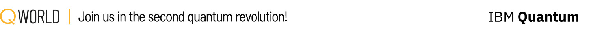

## Uwaga odnośnie tłumaczenia

Wszystkie pliki pochodzą z repozytorium [bronze-qiskit](https://gitlab.com/qworld/bronze-qiskit.git). Wszystkie problemy z działaniem kodu należy kierować na tamto repozytorium.
W tym repozytorium należy zgłaszać jedynie uwagi odnośnie błędnych tłumaczeń.

## [QWorld](https://qworld.net) Bronze-Qiskit

**Bronze** to nasz wprowadzający samouczek dotyczący _**komputerów kwantowych i programowania kwantowego**_ utworzony w październiku 2018.

**Bronze-Qiskit** to wersja Bronze wykorzystująca [**Qiskit**](https://qiskit.org) jako framework do programowania kwantowego. Została wydana w lutym 2021 roku przy wsparciu [**IBM Quantum**](https://www.ibm.com/quantum-computing/).

Bronze to zbiór notebooków Jupyter, a każdy z nich zawiera wiele zadań programistycznych, aby zapewnić praktyczne doświadczenia. Widzimy Bronze jako laboratorium, w którym można nauczyć się podstaw komputerów kwantowych i programowania kwantowego poprzez praktykę. Bronze został już wykorzystany w ponad 50 warsztatach ([najnowsza lista](http://qworld.net/workshop-bronze/#list)) organizowanych przez QWorld. Aby ułatwić przyswajanie wiedzy pomijamy całkowicie temat liczb zespolonych w naszych tutorialach.

### Wymagania wstępne

Jedynym wymaganiem jest znajomość podstaw programowania (zmienne i podstawowe typy danych, pętle i warunki). Jakiekolwiek wcześniejsze doświadczenie związane z językiem Python będzie pomocne. Jeśli nie masz takiego doświadczenia, możesz sprawdzić nasze Jupyter notebooki na temat Pythona przed rozpoczęciem samouczka.

Ponadto w tym kursie znajdziesz notebooki dotyczące podstawowych zagadnień matematycznych, które pozwolą Ci przypomnieć podstawowe operacje arytmetyczne na wektorach i macierzach.

### Sekcje kursu Bronze-Qiskit

- Python (dla szybkiego przeglądu)

- Podstawowa matematyka (dla szybkiego przeglądu)

- Systemy klasyczne: bity, rzucanie monetą, stan probabilistyczny i operatory, systemy złożone, korelacja oraz operatory kontrolowane

- Systemy kwantowe z użyciem Qiskit

    - Podstawy Qiskit: projektowanie obwodów, wizualizacja i symulacja

    - Podstawy kwantowe: kwantowe rzucanie monetą i operator Hadamarda, stany i operatory kwantowe, wizualizacja kubitów o wartościach rzeczywistych, splątanie i pomiary

    - Operatory kwantowe na kubicie o wartościach rzeczywistych (rotacje i odbicia) oraz tomografia kwantowa

    - Splątanie i podstawowe protokoły kwantowe: supergęste kodowanie i teleportacja kwantowa

    - Algorytm Grovera do wyszukiwania

Nasz następny samouczek na poziomie podstawowym _Silver_ jest obecnie w trakcie rewizji, a w 2021 roku rozpoczniemy przygotowania do zaawansowanego samouczka poziomu Gold.

## Współtworzenie

Proszę utwórz pull request lub zgłoś problem dotyczący _literówki_ lub _twoich poprawek_.

Proszę utwórz nowe zgłoszenie dotyczące _twoich pytań_, _rozpoczęcia dyskusji_ lub _zaproponowania zmiany_.

_Bronze jest rozwijane w ramach [departamentu QEducation](https://qworld.net/qeducation/) w ramach QWorld._

## Instalacja

Postępuj zgodnie z instrukcjami zawartymi w [pliku instalacyjnym](installation.pdf)!

<small>

**Korzystając z Binder:** _Możesz [uruchomić Bronzę w chmurze za pomocą bindera](https://mybinder.org/v2/gl/qworld%2Fbronze-qiskit/HEAD?urlpath=lab/tree/START.ipynb) ale **proszę miej świadomość, że**_

- _za każdym razem tworzona jest nowa sesja, co zajmuje trochę czasu na inicjowanie, i wszystkie zmiany są tracone po zakończeniu sesji; oraz,_

- _sesja może zostać zakończona, jeśli w ciągu 10 minut nie zostanie otwarta nowa karta._

</small>

## Licencja

Tekst i ilustracje są licencjonowane na zasadach Creative Commons Attribution 4.0 International Public License (CC-BY-4.0), dostępne pod adresem https://creativecommons.org/licenses/by/4.0/legalcode.

Fragmenty kodu w notatkach są licencjonowane na zasadach licencji Apache License 2.0, dostępnej pod adresem http://www.apache.org/licenses/LICENSE-2.0.

## Podziękowania

Do wyświetlania wyrażeń matematycznych w plikach html (np. ćwiczenia) używamy [MathJax](https://www.mathjax.org).

Do prezentowania eksperymentów z rzucaniem monetą kwantową korzystamy z interaktywnego narzędzia typu open source [quantumgame](http://play.quantumgame.io).

## Uznania

Bronze został stworzony przez [Abuzera Yakaryilmaza](http://abu.lu.lv) (QWorld & QLatvia) w październiku 2018 roku i od tego czasu był przez niego rozwijany i utrzymywany.

Özlem Salehi Köken (QWorld & QTurkey) oraz Maksims Dimitrijevs (QWorld & QLatvia) są innymi współpracownikami, którzy przygotowali nowe notatniki i zrewidowali istniejące.

Bronze został udostępniony publicznie 7 lipca 2019 roku.

Bronze-Qiskit został wydany przez Abuzera Yakaryilmaza w lutym 2021 roku.

### Wykłady wideo

Nagrania wykładów zostały przygotowane przez Abuzera Yakaryilmaza, Özlem Salehi Köken oraz Anastasiję Triznę (QLatvia) w sierpniu 2020 roku.

### Bronze-Qiskit 2021

Agnieszka Wolska przygotowała nową grafikę i loga.

### Brąz 2020 i 2021

Dziękujemy uczestnikom warsztatów QBronze oraz [programowi QTraining for Bronze](https://qworld.net/qtraining-for-bronze-2020/) za ich poprawki i sugestie.

### Brązowy 2019

Dziękujemy mentorom i uczestnikom [QDrive](https://qworld.net/qdrive/) za bardzo pomocne poprawki i sugestie.

Dziękujemy Adamowi Glosowi (QWorld & QPoland) za komentarze dotyczące Bronze 2018.

### Bronze 2018

Dziękujemy Katrinie Kizenbahie z Riga TechGirls za jej poprawki w naszych notatkach na temat języka Python.

Dziękujemy Martinowi Kalisowi (QLatvia) za jego komentarze techniczne dotyczące Pythona, qiskit oraz naszych notebooków.

Dziękujemy Maksimowi Dimitrijewowi (QLatvia) za staranne przeczytanie i poprawienie naszych notebooków.

Dziękujemy pierwszym członkom QLatvia - Martinowi Kalisowi, Maksimowi Dimitrijewowi, Aleksejsowi Naumovsowi, Andisowi Dragunsowi oraz Matissowi Apinisowi za ich pomoc i wsparcie.

Dziękujemy studentom [Wydziału Informatyki](https://www.df.lu.lv) (Uniwersytet Łotwy), którzy uczestniczyli w spotkaniach z programowaniem kwantowym każdego piątku (jesień 2018) za ich komentarze podczas pracy z naszymi notebookami.
